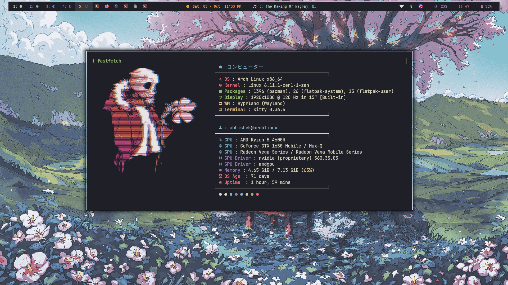
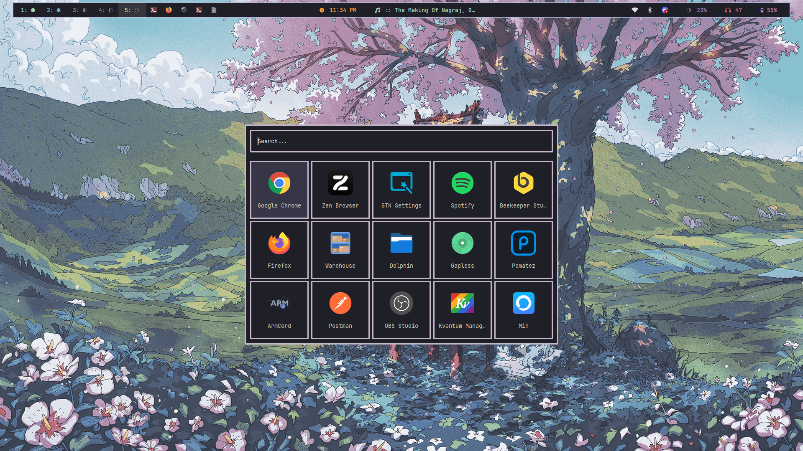

<div align="center">
    <a href="https://discord.gg/AYbJ9MJez7">
            
    </a>
</div>

<div align="center">
    
</div>

---

> **Dive into the deep, where elegance meets the infinite night.**

> [!WARNING]
> The style it diffrent for the orignal Hyde config 

# Abyssal Wave 🌊

Abyssal Wave is a modern, dark theme inspired by the harmonious blend of:

- 🎨 **Kanagawa**: Japanese art and natural beauty.
- ☕ **Catppuccin**: Soft, pastel warmth.
- 🌃 **Tokyo Night**: The futuristic glow of Tokyo's nightlife.

This theme offers a sleek, calming, and immersive experience for developers who value both aesthetics and focus.

---

### 🎯 Features
- **Subtle gradients** that enhance readability.
- **Carefully curated colors** for an aesthetic balance between light and dark.
- Perfect for long coding sessions with **minimal eye strain**.
- Full integration with [HyDe](https://github.com/prasanthrangan/hyprdots), offering a seamless visual experience.

---

### 🚀 Installation

```bash
Hyde theme import Abyssal-Wave 'https://github.com/Itz-Abhishek-Tiwari/Abyssal-Wave'
```

> **Note**: Abyssal Wave is still in **beta**, so expect frequent updates!

---

### 🖼️ Preview





---

### 📂 Explore More Themes
Looking for other themes? Check out the [HyDe Gallery](https://github.com/kRHYME7/hyde-gallery) for more options.


